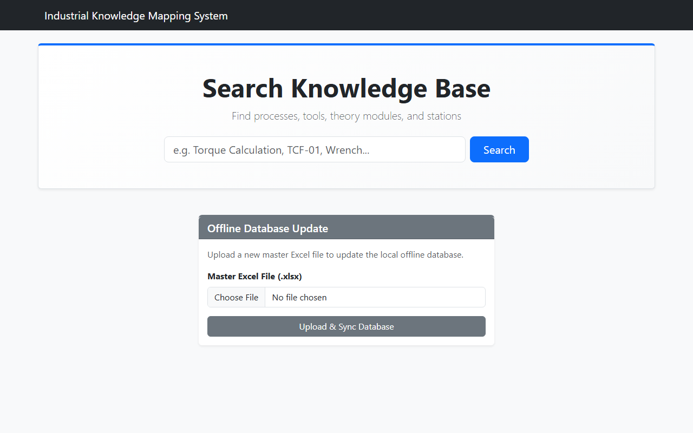
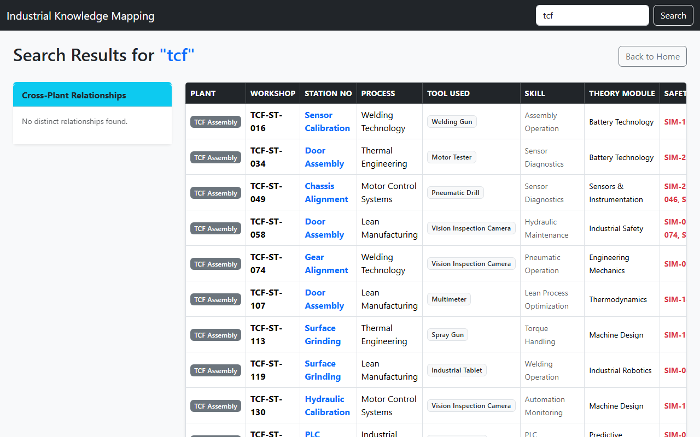

# Offline Industrial Workstation Knowledge Mapping & Search System

A lightweight, fully offline web application designed for a manufacturing environment (similar to Tata Motors workshops) to connect and map workstation knowledge. 

## 📸 Project Screenshots

**Homepage / Database Upload**


**Search Results & Cross-Plant Relationships**


## 🎯 Project Objective
This system acts as a local, offline-first search engine and knowledge base that connects:
- Plants & Workshops
- Station Numbers
- Processes & Tasks
- Tools Used
- Skills Required
- Theory / Syllabus Modules
- Safety Concepts

By uploading a master Excel mapping sheet, the system automatically builds a local SQLite database that allows engineers and floor workers to find cross-plant similarities, search for specific workstation requirements, and trace theory concepts back to actual industrial applications.

## ✨ Core Features
- **100% Offline Execution:** Runs completely locally with zero internet dependency (no external APIs, no cloud services). 
- **Excel Ingestion:** Upload mapping configurations seamlessly via `.xlsx` files using `pandas`.
- **Relational Search:** Search via keyword across multiple domains (e.g., searching "Torque" instantly pulls up related stations, required theory modules, and tools).
- **Cross-Plant Similarity Engine:** Automatically groups and flags similar processes and theoretical applications utilized across completely different plants or workshops.
- **Industrial Dashboard:** Features a clean, responsive Bootstrap-powered UI tailored for industrial and shop-floor usability.

## 🛠️ Technology Stack
- **Frontend:** HTML5, CSS3, Vanilla JavaScript, Bootstrap 5 (served completely locally via downloaded assets).
- **Backend:** Python, Flask
- **Database:** SQLite3
- **Data Processing:** pandas, openpyxl

## 🚀 How to Run Locally

1. **Clone the repository:**
   ```bash
   git clone https://github.com/maitray-agrawal/industrial-workstation-mapping.git
   cd industrial-workstation-mapping
   ```

2. **Set up a Virtual Environment (Optional but recommended):**
   ```bash
   python -m venv venv
   # On Windows:
   .\venv\Scripts\activate
   # On macOS/Linux:
   source venv/bin/activate
   ```

3. **Install Dependencies:**
   ```bash
   pip install -r requirements.txt
   ```

4. **Run the Application:**
   ```bash
   python app.py
   ```

5. **Access the Dashboard:**
   Open your browser and navigate to `http://127.0.0.1:5001`. 
   
   *(Note: The system generates a `sample_mapping.xlsx` file out of the box. You can upload this file via the UI to immediately populate the database and start searching!)*
